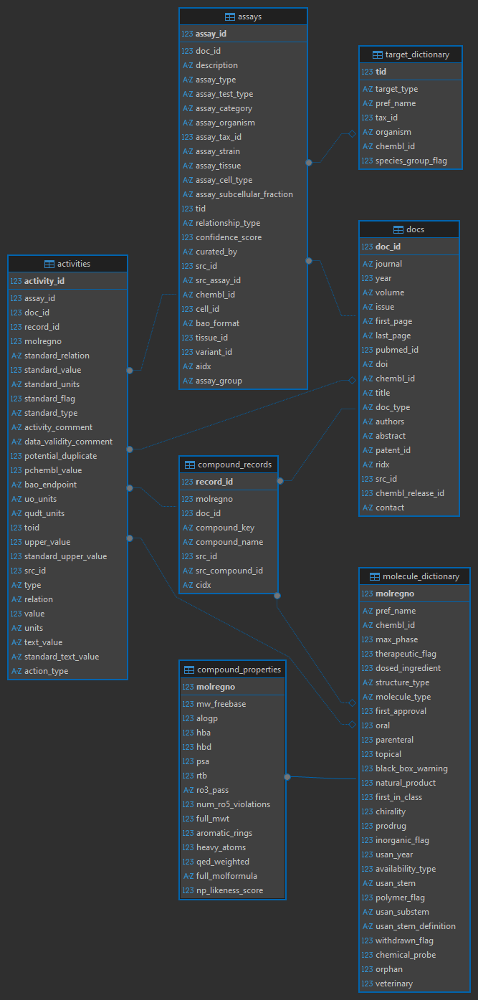
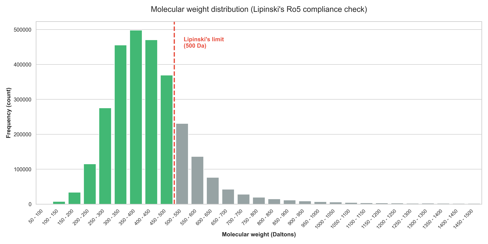
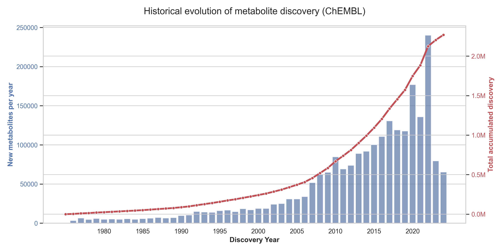

# ChEMBL Drug Discovery Analytics 🧬📊


## 📌 Project Overview

This project utilizes **Advanced SQL** and **Python** to extract actionable business and scientific insights from **ChEMBL**, a large-scale open bioactivity database managed by EMBL-EBI.

Leveraging my background as a **Biotechnologist and MSc in Analytical Chemistry**, I acted as a Data Analyst to transform **complex relational scientific data** into intelligence regarding pharmaceutical market trends, product quality compliance (Lipinski's Rule), and bioactivity profiling.

**Key Objectives:**
1.  **Scientific Impact:** Evaluate the "popularity" of compounds based on academic citations and identify key publishing journals.
2.  **Market Trends:** Analyze the historical evolution of metabolite discovery using Time Series logic.
3.  **Data Validation:** Audit approved drugs against "Lipinski's Rule of 5" to measure theoretical compliance vs. real-world application.
4.  **Target Analysis:** Filter and rank high-potency compounds for human targets using complex multi-table joins.

---

## 🛠️ Tech Stack & Skills

* **Database:** SQLite (ChEMBL Database Version 36).
* **Language:** SQL.
* **Key Techniques:**
    * ✅ **Window Functions** for running totals (cumulative analysis).
    * ✅ **CTEs (Common Table Expressions)** for modularizing complex logic.
    * ✅ **Advanced Joins** connecting 4+ tables (Metabolites → Activities → Assays → Targets).
    * ✅ **Data Cleaning** (Handling `NULL`s, String Manipulation, Deduplication).

---

## 🗄️ Data Model & Schema

The analysis performs complex joins across multiple normalized tables within the ChEMBL database (e.g., `molecule_dictionary`, `compound_properties`, `activities`, `assays`, `compound_records`, `docs`).


*(Entity Relationship Diagram of the tables used in this project)*

---

## 📂 Repository Structure

The project is organized into two main directories for clarity and reproducibility:

### `src/` (Source Code)
Contains the SQL logic for data extraction and the Python script for data visualization.
* **`01_setup_views.sql`**: Initial setup and data cleaning (creating Views with molecular weight filters).
* **`02_scientific_literature.sql`**: Bibliometric analysis (citations and top journals).
* **`03_mass_distribution.sql`**: Physical property distribution (Data Binning).
* **`04_drug_properties.sql`**: "Druggability" audit (Lipinski's Rule validation).
* **`05_activity_potency.sql`**: Potency ranking (IC50) for *Homo sapiens* targets.
* **`06_historical_discovery.sql`**: Time-series analysis of discovery trends.
* **`generate_graphs.py`**: A Python script that connects to the database, executes the SQL queries, and generates the figures found in the `assets/` folder using Pandas and Matplotlib/Seaborn.

### `assets/` (Figures & Diagrams)
Contains the ERD schema and the visual outputs generated by the analysis.

### `data/` (SQL resulting data)
Contains the data resulting from SQL query 03 and 06 used by `generate_graphs.py` to create graphs.
* **`mass_distribution.csv`**: Resulting table from query 03.
* **`historical_evolution.csv`**: Resulting table from query 06.
---

## 📊 Business Questions & Insights

### 1. Scientific Literature Evaluation 📚
**The Business Question:** *Which metabolites drive the most academic research and which journals are the primary sources of this knowledge?*

**The Solution:** Aggregated citation counts from the `docs` and `compound_records` tables.

#### **A. Top 10 Most Cited Metabolites**

```sql
SELECT m.name, COUNT(d.doi) AS "citations"
FROM metabolites m 
	JOIN compound_records cr
		ON m.molregno = cr.molregno
	JOIN docs d
		ON cr.doc_id = d.doc_id
GROUP BY m.molregno
ORDER BY COUNT(d.doi) DESC LIMIT 10;
```

> **Insight:** The analysis reveals that established antibiotics (e.g., **ciprofloxacin, rifampin, vancomycin**) and chemotherapy agents (e.g., **doxorubicin, paclitaxel**) dominate scientific literature. The high prominence of **Chloroquine** reflects the surge in drug repurposing research related to recent global health crises (COVID-19).

| Rank | Metabolite Name | Citations (DOI) |
| :--- | :--- | :--- |
| 1 | DOXORUBICIN | 2323 |
| 2 | CIPROFLOXACIN | 1668 |
| 3 | PACLITAXEL | 1387 |
| 4 | CHLOROQUINE | 1316 |
| 5 | RIFAMPIN | 1111 |

#### **B. Top Journals by Metabolite Mentions**

```sql
SELECT d.journal, COUNT(m.molregno) AS "metabolites_mentions"
FROM metabolites m 
	JOIN compound_records cr
		ON m.molregno = cr.molregno
	JOIN docs d
		ON cr.doc_id = d.doc_id
GROUP BY d.journal
HAVING d.journal IS NOT NULL
ORDER BY COUNT(m.molregno) DESC LIMIT 10;
```

> The *Journal of Medicinal Chemistry* stands out as the leading repository of bioactivity data.

| Rank | Journal Name | Metabolite Mentions |
| :--- | :--- | :--- |
| 1 | J Med Chem | 653,827 |
| 2 | Bioorg Med Chem Lett | 445,282 |
| 3 | Eur J Med Chem | 297,752 |

---

### 2. "Lipinski's Rule of 5" Compliance Audit ⚖️

> **Concept Note:** Lipinski's Rule of 5 (Ro5) is a guideline used to predict oral "druggability." Poor absorption is likely if a compound violates specific thresholds (MW > 500, LogP > 5, etc.) [1,2].

**The Business Question:** *What percentage of approved oral drugs actually strictly follow Lipinski's Rule of 5?*

```sql
SELECT cp.num_ro5_violations AS "violations", 
	COUNT(m.molregno) AS "drugs", 
	ROUND(COUNT(m.molregno) * 100.0 / SUM(COUNT(m.molregno)) OVER (), 2) || " %" AS "drugs_percentage"
FROM metabolites m 
	JOIN molecule_dictionary md
		ON m.molregno = md.molregno
	JOIN compound_properties cp
		ON m.molregno = cp.molregno
WHERE (md.max_phase = 4
		AND md.oral = 1
		AND cp.num_ro5_violations IS NOT NULL)
GROUP BY cp.num_ro5_violations
ORDER BY cp.num_ro5_violations DESC;
```

**The Solution:** Calculated compliance percentages using conditional aggregation, strictly filtering for `max_phase = 4` (Approved) and `oral = 1`.

| Ro5 Violations | Count of Drugs | Percentage |
| :--- | :--- | :--- |
| **0 (Compliant)** | **1,418** | **77.36%** |
| 1 | 256 | 13.97% |
| 2 | 143 | 7.80% |
| 3 | 15 | 0.82% |

> **Insight:** The analysis demonstrates that **77% of approved oral drugs are fully compliant**. However, nearly **22% of successful drugs violate at least one criterion**, reinforcing that while Ro5 is an excellent screening tool, it is not an absolute barrier for drug success.


*(Chart generated via Python)*

---

### 3. Bioactivity & Potency Profiling 🎯

> **Concept Note:** **IC50** (Half-maximal inhibitory concentration) is a measure of the potency of a substance in inhibiting a specific biological or biochemical function. It indicates how much of a drug is needed to inhibit a biological process by 50% [3]. In the context of this project, **lower IC50 values represent higher potency** against human targets.

**The Business Question:** *Which metabolites show the highest potency (lowest IC50) specifically against Homo sapiens targets?*

```sql
SELECT 	m.pref_name AS name, top_activities.ic50, top_activities.units
FROM (
	SELECT 
		a.molregno, 
		a.standard_value AS "IC50", 
		a.standard_units AS "units"
	FROM activities a
		JOIN assays aa ON a.assay_id = aa.assay_id
		JOIN target_dictionary td ON aa.tid = td.tid
	WHERE a.standard_type = 'IC50'
		AND a.potential_duplicate = 0
		AND td.organism = 'Homo sapiens'
		AND a.standard_value IS NOT NULL
		AND a.standard_value > 0  
) AS top_activities 
JOIN molecule_dictionary m
	ON top_activities.molregno = m.molregno
WHERE m.pref_name IS NOT NULL
ORDER BY top_activities.IC50 ASC LIMIT 10;
```

**The Solution:** Executed a 4-level JOIN strategy to link chemical structures to biological targets, ensuring correct organism filtering and data quality.

| Name | IC50 | Units |
| :--- | :--- | :--- |
| ... | ... | ... |
| TAK-020 |	0.000000005012 | nM
| LEVOSULPIRIDE |	0.00000002 | nM
| ... | ... | ... |

> **Result:** The query successfully extracted a ranked list of compounds with activity in the picomolar/nanomolar range, which are critical candidates for the initial phases of Drug Discovery.
> **Note:** The ranking includes mixed units (nM and ug.mL-1) as found in the raw database.

---

### 4. Historical Evolution of Drug Discovery 📈
**The Business Question:** *How has the volume of new metabolite discoveries evolved over the last decades?*

```sql
WITH historical_discovery AS (
	SELECT m.molregno, MIN(d.year) AS "discovery_year"
	FROM metabolites m 
		JOIN compound_records cr
			ON m.molregno = cr.molregno
		JOIN docs d
			ON cr.doc_id = d.doc_id
	WHERE d.year IS NOT NULL
	GROUP BY m.molregno
)
SELECT discovery_year, 
	COUNT(molregno) AS "metabolites_count",
	SUM(COUNT(molregno)) OVER(ORDER BY discovery_year) AS "accumulated_metabolites_count"
FROM historical_discovery
GROUP BY discovery_year
ORDER BY discovery_year ASC;
```

**The Solution:** Aggregated data by publication years and a calculate the cumulative sum (running total) of discoveries.

| Year | New Metabolites | Accumulated Total |
| :--- | :--- | :--- |
| ... | ... | ... |
| 1990 | 9,607 | 87,825 |
| 1995 | 15,921 | 156,914 |
| ... | ... | ... |

> **Insight:** The analysis shows a consistent exponential growth in the identification of new metabolites, accelerating significantly after the year 2000. This is likely driven by the advent of High-Throughput Screening (HTS) and High-Resolution Mass Spectrometry (HRMS) technologies.


*(Chart generated via Python)*

---

## 📚 References

1.  Benet, L. Z., Hosey, C. M., Ursu, O., & Oprea, T. I. (2016). BDDCS, the Rule of 5 and Drugability. *Advanced Drug Delivery Reviews*, 101, 89–98.
2.  Lambev, M., Mihaylova, S., & Georgieva, D. (2025). Machine Learning-Based Prediction of Rule Violations for Drug-Likeness Assessment in Peptide Molecules Using Random Forest Models. *International Journal of Molecular Sciences*, 26(17), 8407.
3.  Sebaugh, J. L. (2011). Guidelines for accurate EC50/IC50 estimation. *Pharmaceutical Statistics*, 10(2), 128–134.

---

## ⚖️ License & Data Attribution

**Code License:** MIT License.

**Data Source:**
This analysis uses data from **ChEMBL** (EMBL-EBI), licensed under [CC BY-SA 3.0](https://creativecommons.org/licenses/by-sa/3.0/).

---

### 📬 Contact
**Anna Clara Couto**
* [LinkedIn](https://www.linkedin.com/in/annacouto/)
